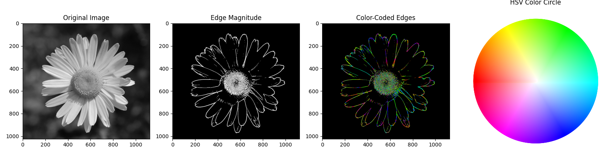

# Computer-Vision

A personal repo for adding codes that I used in Computer Vision apliccations or projects I made.

# Edge Detection and Angle of Edge computation

Edge detection is a fundamental image processing technique used to identify boundaries within an image. Edges are regions in an image where there is a significant change in intensity or color. Detecting these edges is crucial in various computer vision and image analysis tasks, such as object recognition, image segmentation, and feature extraction.

One of the popular methods for edge detection is the Sobel operator, which is a convolution-based filter used to highlight edges in an image. The Sobel operator is specifically designed to capture changes in intensity along both horizontal and vertical directions.

## Sobel Operator

The Sobel operator consists of two 3x3 kernels, one for detecting changes in intensity along the horizontal axis (Sobel-X) and the other along the vertical axis (Sobel-Y). These kernels are convolved with the image to compute the gradient magnitude and direction at each pixel.

The Sobel-X kernel:

||||
|----|---|---|
| -1 | 0 | 1 |
| -2 | 0 | 2 | 
| -1 | 0 | 1 | 

The Sobel-Y kernel:

||||
|----|---|---|
|-1| -2| -1|
| 0|  0|  0|
| 1|  2|  1|

To compute the edge strength (magnitude) at each pixel, you calculate the gradient using both Sobel-X and Sobel-Y operators and then find the magnitude using the following formula:

$Magnitude = \sqrt{Sobel_x^2+Sobel_y^2}$

The direction of the edge (angle) is computed as:

$Angle = \atan{Sobel_y,Sobel_x}$

